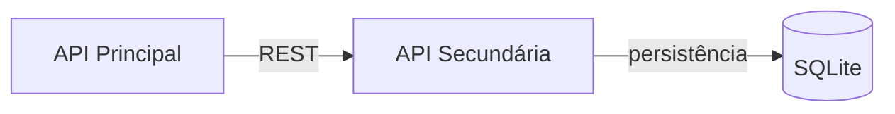

# API Secundária — Estante de Livros

Componente responsável por persistir a estante pessoal de leitura do usuário
(livros salvos, status de leitura e nota), usando **SQLite**.

## Arquitetura



## Rotas

| Método | Rota                | Descrição                                  |
|--------|---------------------|----------------------------------------------|
| GET    | `/estante`          | Lista todos os livros da estante (filtro opcional por `status`) |
| GET    | `/estante/{id}`     | Retorna um livro específico da estante        |
| POST   | `/estante`          | Adiciona um novo livro à estante              |
| PUT    | `/estante/{id}`     | Atualiza status de leitura e/ou nota          |
| DELETE | `/estante/{id}`     | Remove um livro da estante                    |

`status` aceita os valores: `quero_ler`, `lendo`, `lido`.
`nota` é um inteiro de 0 a 5.

## Instalação e execução

### Com Docker (recomendado)

```bash
docker build -t api-secundaria .
docker run -p 8001:8001 -v estante-db:/app/data -e DB_PATH=/app/data/estante.db api-secundaria
```

### Localmente (sem Docker)

```bash
python -m venv venv
source venv/bin/activate   # Windows: venv\Scripts\activate
pip install -r requirements.txt
uvicorn main:app --reload --port 8001
```

Depois acesse a documentação interativa em: http://localhost:8001/docs
